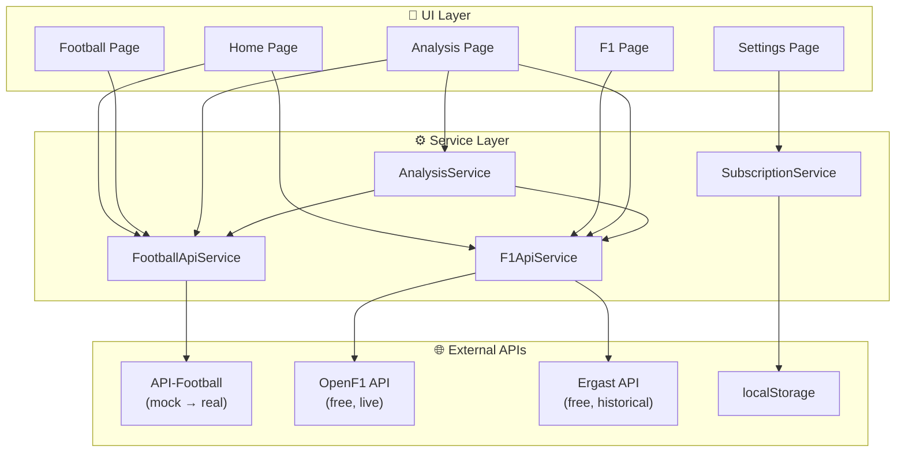
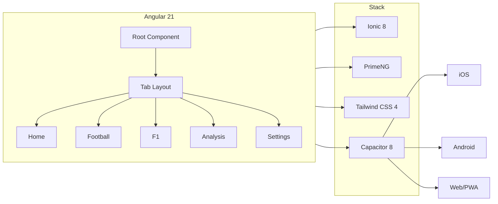

# 🏟 Sport Aggregator

A mobile-first sport aggregator for **Football** and **Formula 1** — fixtures, standings, race calendars, and pre-match analysis, all in one app.

## ✨ Features

- **Home Feed** — Upcoming fixtures and races at a glance, filterable by sport
- **Football** — League selector, fixtures, results, and standings table
- **Formula 1** — Race calendar (from Ergast API), driver standings, constructor standings
- **Analysis** — Head-to-head team comparisons and driver-at-circuit performance analysis
- **Settings** — Dark/light mode, default sport, notification preferences, subscriptions

## 🛠 Tech Stack

| Layer | Technology |
|-------|-----------|
| Framework | Angular 21 (standalone components, signals) |
| UI | Ionic 8 (iOS mode) |
| Components | PrimeNG 21 |
| Styling | Tailwind CSS 4 + Custom SCSS |
| APIs | API-Football (mock), OpenF1/Ergast (live+mock) |
| Mobile | Capacitor 8 (iOS + Android ready) |
| Fonts | Sora (headings) + DM Sans (body) |

## 📁 Project Structure

```
sport-aggregator/
├── src/
│   ├── app/
│   │   ├── models/               # TypeScript interfaces
│   │   │   ├── football.model.ts # Sport, League, Team, Fixture, Standing, etc.
│   │   │   ├── f1.model.ts       # Driver, Constructor, Race, Circuit, etc.
│   │   │   ├── subscription.model.ts  # User subscriptions & preferences
│   │   │   └── index.ts          # Barrel export
│   │   ├── services/             # Data & business logic
│   │   │   ├── football-api.service.ts   # API-Football wrapper (mock data)
│   │   │   ├── f1-api.service.ts         # OpenF1 + Ergast API wrapper (live!)
│   │   │   ├── subscription.service.ts   # localStorage-backed subscriptions
│   │   │   ├── analysis.service.ts       # H2H & driver circuit analysis
│   │   │   └── index.ts
│   │   ├── pages/
│   │   │   ├── home/             # Sport feed — upcoming fixtures & races
│   │   │   ├── football/         # League fixtures, results, standings
│   │   │   ├── f1/               # Race calendar, driver & constructor standings
│   │   │   ├── analysis/         # H2H comparison & driver analysis tools
│   │   │   └── settings/         # App preferences & subscriptions
│   │   ├── app.ts                # Root component
│   │   ├── app.tabs.ts           # Tab bar layout (5 tabs)
│   │   ├── app.routes.ts         # Lazy-loaded routes
│   │   ├── app.config.ts         # Providers (router, Ionic, HTTP, animations)
│   │   └── app.scss
│   ├── styles.scss               # Global theme (dark-first)
│   ├── index.html                # Entry HTML with Google Fonts
│   └── main.ts                   # Bootstrap
├── angular.json
├── package.json
├── tsconfig.json
└── README.md
```

## 🔄 Data Flow



## 🏗 Architecture



## 🚀 Getting Started

```bash
# Install dependencies
npm install

# Start dev server
ng serve

# Build for production
ng build

# Add mobile platforms
npx cap add ios
npx cap add android
npx cap sync
```

## 🔌 API Configuration

### Football (API-Football)
Currently using mock data. To connect:
1. Register at [api-sports.io](https://www.api-sports.io/) (free tier: 100 req/day)
2. Set your API key in `football-api.service.ts`
3. Uncomment the real API calls

### Formula 1
- **OpenF1** (`api.openf1.org`) — Free, no API key needed, live session data
- **Ergast** (`ergast.com/mrd/`) — Free, no key needed, historical data & standings

## 📝 Changelog

### v0.1.0 (2026-02-13)
- 🎉 Initial release
- ⚽ Football page with fixtures, results, standings (mock data)
- 🏎 F1 page with race calendar, driver & constructor standings (Ergast API)
- 📊 Analysis page: football H2H and driver circuit analysis
- ⚙️ Settings with dark mode, preferences, subscriptions
- 🏠 Home feed combining football + F1 upcoming events
