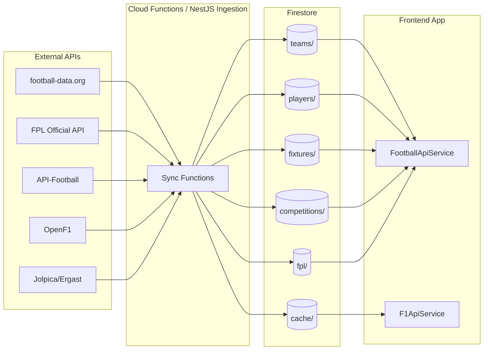
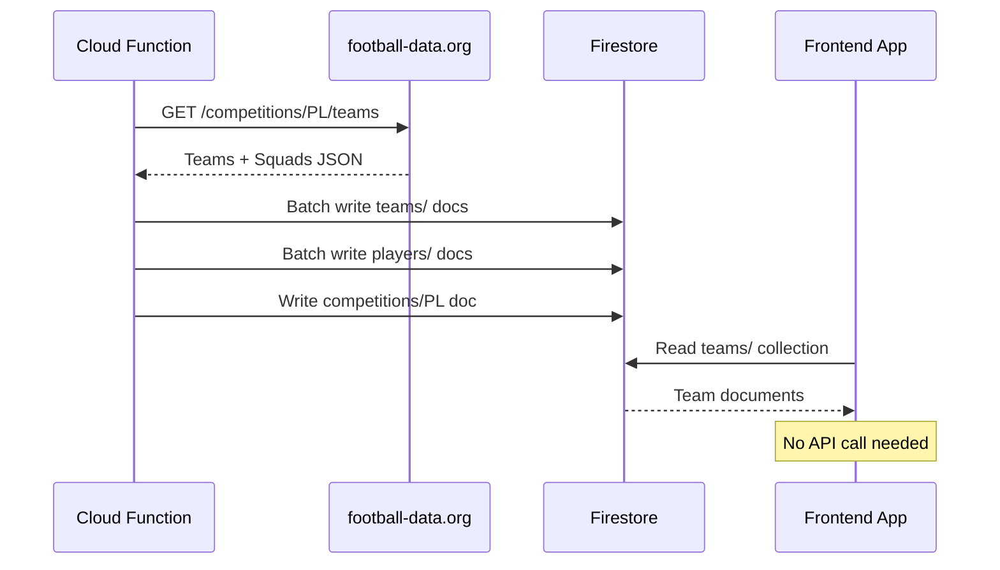
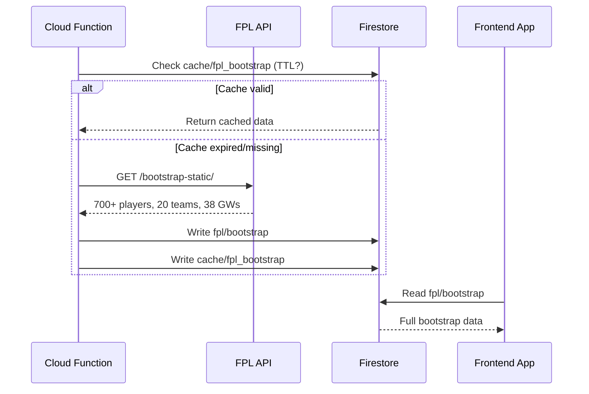
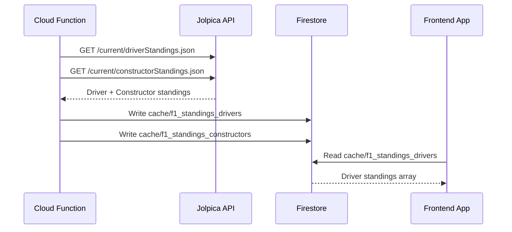
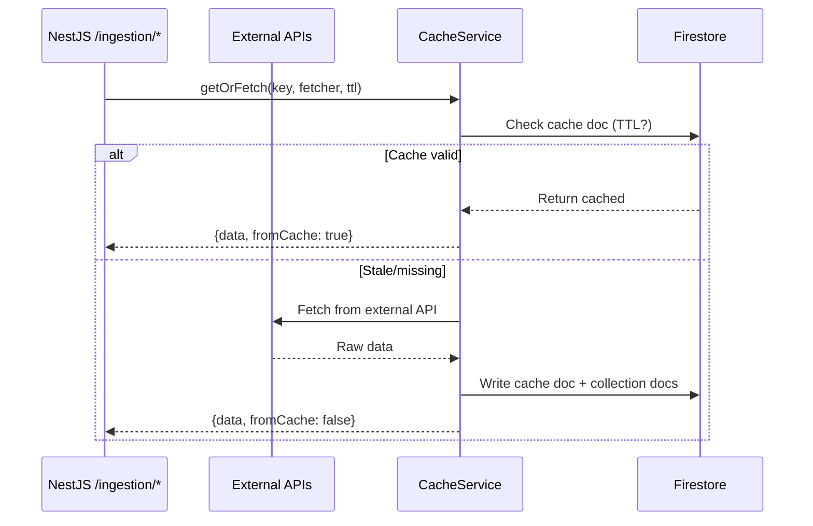

# 🗄️ Data Architecture — Sport Aggregator

> How data flows from external APIs → Firestore → App

---

## Overview

The app uses a **write-through cache** pattern. Cloud Functions (or NestJS ingestion endpoints) fetch from external APIs, write to Firestore, and the frontend reads directly from Firestore. This eliminates redundant API calls — one fetch serves all users.

---

## Firestore Collections

### `teams/`
| Field | Type | Source |
|-------|------|--------|
| `id` | number | football-data.org |
| `name` | string | Team full name |
| `shortName` | string | Short name |
| `tla` | string | Three-letter abbreviation |
| `crest` | string | Logo URL |
| `address` | string | Club address |
| `website` | string | Club website |
| `founded` | number | Year founded |
| `clubColors` | string | Club colors |
| `venue` | string | Stadium name |
| `competitionCode` | string | e.g. "PL" |
| `coach` | object\|null | Coach details |
| `squadCount` | number | Number of squad players |
| `lastUpdated` | timestamp | Server timestamp |

**Doc ID**: Team ID (e.g. `"57"` for Arsenal)
**Written by**: `fetchEplTeams` / `syncTeams`
**TTL**: 24 hours

### `players/`
| Field | Type | Source |
|-------|------|--------|
| `id` | number | football-data.org |
| `name` | string | Full name |
| `firstName` | string\|null | First name |
| `lastName` | string\|null | Last name |
| `dateOfBirth` | string | ISO date |
| `nationality` | string | Nationality |
| `position` | string | GK/DEF/MID/FWD |
| `shirtNumber` | number\|null | Shirt number |
| `teamId` | number | Parent team ID |
| `teamName` | string | Team name |
| `teamTla` | string | Team abbreviation |
| `competitionCode` | string | e.g. "PL" |
| `lastUpdated` | timestamp | Server timestamp |

**Doc ID**: Player ID (e.g. `"1234"`)
**Written by**: `fetchEplPlayers` / `syncPlayers`
**TTL**: 24 hours

### `fixtures/`
| Field | Type | Source |
|-------|------|--------|
| `id` | number | football-data.org |
| `competition` | object | `{id, name}` |
| `season` | object | `{id, startDate, endDate}` |
| `utcDate` | string | ISO datetime |
| `status` | string | SCHEDULED/LIVE/FINISHED |
| `matchday` | number | Matchday number |
| `homeTeam` | object | `{id, name, shortName, tla, crest}` |
| `awayTeam` | object | `{id, name, shortName, tla, crest}` |
| `score` | object | Full/half time scores |
| `competitionCode` | string | e.g. "PL" |
| `lastUpdated` | timestamp | Server timestamp |

**Doc ID**: Fixture ID (e.g. `"501234"`)
**Written by**: `syncFixtures`
**TTL**: 1 hour

### `competitions/{code}`
| Field | Type |
|-------|------|
| `id` | number |
| `name` | string |
| `code` | string |
| `emblem` | string |
| `country` | string |
| `currentSeason` | object |
| `lastUpdated` | timestamp |

**Subcollection**: `standings/current`
| Field | Type |
|-------|------|
| `competitionId` | number |
| `competitionName` | string |
| `season` | object |
| `standings` | array of standing groups |
| `lastUpdated` | timestamp |

### `fpl/`
| Doc | Contents | TTL |
|-----|----------|-----|
| `bootstrap` | `elements[]`, `teams[]`, `events[]`, `element_types[]` | 24h |
| `live_{gw}` | `elements[]` with live gameweek points | 10s |

### `cache/`
General-purpose TTL cache. Each doc has `key`, `data`, `createdAt`, `expiresAt`, `ttlMs`.

| Key Pattern | Contents | TTL | Source |
|-------------|----------|-----|--------|
| `fixtures` | All PL fixtures array | 1h | football-data.org |
| `standings_PL` | PL standings | 1h | football-data.org |
| `fpl_bootstrap` | Full FPL bootstrap | 24h | FPL API |
| `fpl_live_{gw}` | Live GW points | 10s | FPL API |
| `fpl_player_{id}` | Player history | 6h | FPL API |
| `fpl_prices` | Price changes | — | FPL API |
| `f1_standings_drivers` | Driver standings array | 24h | Jolpica |
| `f1_standings_constructors` | Constructor standings array | 24h | Jolpica |
| `f1_races_{year}` | Race calendar array | 24h | Jolpica |
| `f1_positions_{session}` | Live positions | 5s | OpenF1 |
| `f1_laps_{session}` | Lap data | 10s | OpenF1 |
| `f1_pitstops_{session}` | Pit stops | 15s | OpenF1 |

---

## Data Flow Diagrams

### Football Data Sync

### FPL Bootstrap Sync

### F1 Standings Sync

### NestJS Ingestion (B2B Backend)

---

## Sync Triggers

| Method | When | Endpoints |
|--------|------|-----------|
| **Manual** | Hit Cloud Function URL or NestJS ingestion endpoint | All |
| **NestJS sync-all** | `POST /ingestion/sync-all` (API key required) | Football + FPL + F1 |
| **Future: Cron** | Scheduled Cloud Functions (not yet implemented) | Daily: teams, players, standings, FPL bootstrap, F1 standings/races. Hourly: fixtures |

---

## Cost Optimization

| Strategy | Implementation |
|----------|----------------|
| **Server-side cache** | One API call → Firestore doc → serves all users |
| **TTL-based freshness** | 5s (live) → 24h (static) per data type |
| **No client API calls** | Frontend reads Firestore only |
| **Batch writes** | Teams/players use Firestore batches (500 doc limit) |
| **Cache-first reads** | NestJS services check cache before external APIs |

### Estimated API Costs
| API | Cost | Calls/day | Monthly |
|-----|------|-----------|---------|
| football-data.org | Free (10 req/min) | ~50 | $0 |
| FPL Official | Free | ~100 | $0 |
| OpenF1 | Free | Variable (live sessions) | $0 |
| Jolpica/Ergast | Free | ~10 | $0 |
| API-Football Pro | $9.99/mo | ~200 | $9.99 |
| **Total** | | | **$9.99/mo** |

### Estimated Firestore Costs
| Operation | Estimate/day | Cost |
|-----------|-------------|------|
| Writes (sync) | ~1,000 | $0.0018 |
| Reads (app users) | ~10,000 | $0.006 |
| **Monthly total** | | **~$0.25** |
