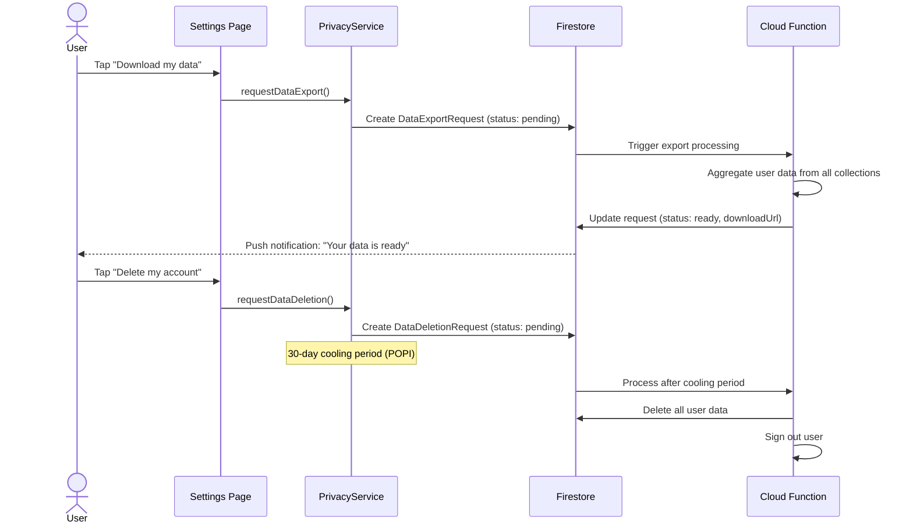

# 📋 Feature Registry — Sport Aggregator

> Every feature in the system, its status, data flow, and where it lives.

---

## Feature Index

| # | Feature | Domain | Status | Frontend | Backend | Docs |
|---|---------|--------|--------|----------|---------|------|
| F-001 | Google Sign-In | Auth | ✅ Done | `login.page.ts` | Firebase Auth | `pages/login/feature.md` |
| F-002 | Apple Sign-In | Auth | ✅ Done | `login.page.ts` | Firebase Auth | `pages/login/feature.md` |
| F-003 | Auth Guards | Auth | ✅ Done | `guards/auth.guard.ts` | — | `pages/login/feature.md` |
| F-004 | EPL Team Ingestion | Data | ✅ Done | — | `fetchEplTeams` | `functions/src/feature.md` |
| F-005 | EPL Player Ingestion | Data | ✅ Done | — | `fetchEplPlayers` | `functions/src/feature.md` |
| F-006 | FPL Bootstrap Sync | Data | ✅ Done | — | `syncFplBootstrap` | `functions/src/feature.md` |
| F-007 | FPL Live Points | Data | ✅ Done | — | `getFplLivePoints` | `functions/src/feature.md` |
| F-008 | FPL Price Changes | Data | ✅ Done | — | `getFplPriceChanges` | `functions/src/feature.md` |
| F-009 | FPL Player Summary | Data | ✅ Done | — | `getFplPlayerSummary` | `functions/src/feature.md` |
| F-010 | Live Match Scores | Data | ✅ Done | — | `getLiveScores` | `functions/src/feature.md` |
| F-011 | Match Events | Data | ✅ Done | — | `getMatchEvents` | `functions/src/feature.md` |
| F-012 | Match Lineups | Data | ✅ Done | — | `getMatchLineups` | `functions/src/feature.md` |
| F-013 | Match Stats | Data | ✅ Done | — | `getMatchStats` | `functions/src/feature.md` |
| F-014 | Match Predictions | Data | ✅ Done | — | `getMatchPredictions` | `functions/src/feature.md` |
| F-015 | F1 Live Positions | Data | ✅ Done | — | `getF1Positions` | `functions/src/feature.md` |
| F-016 | F1 Lap Data | Data | ✅ Done | — | `getF1Laps` | `functions/src/feature.md` |
| F-017 | F1 Pit Stops | Data | ✅ Done | — | `getF1PitStops` | `functions/src/feature.md` |
| F-018 | F1 Race Control | Data | ✅ Done | — | `getF1RaceControl` | `functions/src/feature.md` |
| F-019 | F1 Intervals | Data | ✅ Done | — | `getF1Intervals` | `functions/src/feature.md` |
| F-020 | F1 Standings Sync | Data | ✅ Done | — | `syncF1Standings` | `functions/src/feature.md` |
| F-021 | Cache Management | Data | ✅ Done | — | `getCacheStatus`, `clearCache` | `functions/src/feature.md` |
| F-022 | Dashboard | Frontend | ✅ Done | `home.page.ts` | — | `feature.md` |
| F-023 | Football Hub | Frontend | ✅ Done | `football.page.ts` | — | — |
| F-024 | F1 Hub | Frontend | ✅ Done | `f1.page.ts` | — | — |
| F-025 | Points Projector | Frontend | ✅ Done | `projections.page.ts` | — | `feature.md` |
| F-026 | Dream Team Builder | Frontend | ✅ Done | `dream-team.page.ts` | — | `feature.md` |
| F-027 | Fixture Difficulty Rating | Frontend | ✅ Done | `fdr.page.ts` | — | `feature.md` |
| F-028 | Captain Recommender | Frontend | ✅ Done | `captain.page.ts` | — | `feature.md` |
| F-029 | Form Tracker | Frontend | ✅ Done | `form-tracker.page.ts` | — | `feature.md` |
| F-030 | Differential Finder | Frontend | ✅ Done | `differentials.page.ts` | — | `feature.md` |
| F-031 | H2H Comparison | Frontend | ✅ Done | `compare.page.ts` | — | `feature.md` |
| F-032 | Transfer Watchlist | Frontend | ✅ Done | `watchlist.page.ts` | — | `feature.md` |
| F-033 | Gameweek Digest | Frontend | ✅ Done | `digest.page.ts` | — | `feature.md` |
| F-034 | Points Simulator | Frontend | ✅ Done | `simulator.page.ts` | — | `feature.md` |
| F-035 | Settings & Preferences | Frontend | ✅ Done | `settings.page.ts` | — | — |
| F-036 | Design System (Command Center) | Frontend | ✅ Done | `styles.scss` | — | `feature.md` |
| F-037 | Subscription Type System | Subscription | ✅ Done | `@types/subscription/` | — | `docs/COMPLIANCE.md` |
| F-038 | Tier Configuration | Subscription | ✅ Done | `config/tiers.config.ts` | — | `docs/COMPLIANCE.md` |
| F-039 | Tier Service | Subscription | ✅ Done | `services/tier.service.ts` | — | `docs/COMPLIANCE.md` |
| F-040 | Usage Tracking Service | Subscription | ✅ Done | `services/usage-tracking.service.ts` | — | `docs/COMPLIANCE.md` |
| F-041 | Privacy Service | Subscription | ✅ Done | `services/privacy.service.ts` | — | `docs/COMPLIANCE.md` |
| F-042 | Paywall Component | Subscription | ✅ Done | `components/paywall/` | — | `docs/COMPLIANCE.md` |
| F-043 | Blurred Content Component | Subscription | ✅ Done | `components/blurred-content/` | — | `docs/COMPLIANCE.md` |
| F-044 | Usage Badge Component | Subscription | ✅ Done | `components/usage-badge/` | — | `docs/COMPLIANCE.md` |
| F-045 | Tier Guards | Subscription | ✅ Done | `guards/tier.guard.ts` | — | `docs/COMPLIANCE.md` |
| F-046 | Consent Guard | Subscription | ✅ Done | `guards/consent.guard.ts` | — | `docs/COMPLIANCE.md` |
| F-047 | Privacy Policy Page | Legal | ✅ Done | `pages/legal/privacy-policy.page.ts` | — | `docs/COMPLIANCE.md` |
| F-048 | Terms of Service Page | Legal | ✅ Done | `pages/legal/terms.page.ts` | — | `docs/COMPLIANCE.md` |
| F-049 | Consent Page | Legal | ✅ Done | `pages/legal/consent.page.ts` | — | `docs/COMPLIANCE.md` |
| F-050 | Settings Subscription & Privacy | Subscription | ✅ Done | `pages/settings/settings.page.ts` | — | `docs/COMPLIANCE.md` |
| F-051 | B2B API — NestJS Bootstrap | B2B API | ✅ Done | `nest-js-backend/src/main.ts` | — | `docs/B2B-API.md` |
| F-052 | B2B API — API Key Auth Guard | B2B API | ✅ Done | `nest-js-backend/src/common/guards/api-key.guard.ts` | — | `docs/B2B-API.md` |
| F-053 | B2B API — Auth Module (Key CRUD) | B2B API | ✅ Done | `nest-js-backend/src/modules/auth/` | — | `docs/B2B-API.md` |
| F-054 | B2B API — Football Module | B2B API | ✅ Done | `nest-js-backend/src/modules/football/` | — | `docs/B2B-API.md` |
| F-055 | B2B API — FPL Module | B2B API | ✅ Done | `nest-js-backend/src/modules/fpl/` | — | `docs/B2B-API.md` |
| F-056 | B2B API — F1 Module | B2B API | ✅ Done | `nest-js-backend/src/modules/f1/` | — | `docs/B2B-API.md` |
| F-057 | B2B API — Usage Tracking | B2B API | ✅ Done | `nest-js-backend/src/modules/usage/` | — | `docs/B2B-API.md` |
| F-058 | B2B API — Swagger Documentation | B2B API | ✅ Done | `nest-js-backend/src/main.ts` | — | `docs/B2B-API.md` |
| F-059 | B2B API — Response Wrapper | B2B API | ✅ Done | `nest-js-backend/src/common/interceptors/` | — | `docs/B2B-API.md` |
| F-060 | B2B API — Dockerfile | B2B API | ✅ Done | `nest-js-backend/Dockerfile` | — | `docs/B2B-API.md` |

---

## Data Flow Diagrams

### Authentication Flow


### FPL Data Pipeline


### Live Match Data Pipeline


### F1 Live Data Pipeline


### Caching Strategy


### Fantasy Points Projection Flow

```mermaid
flowchart TD
    INPUT[Player + Upcoming Fixture] --> FORM[Form Analysis - Last 5 GWs]
    INPUT --> FDR[Fixture Difficulty Rating]
    INPUT --> HA[Home/Away Multiplier]
    INPUT --> HIST[Historical vs Opponent]

    FORM --> ENGINE[Projection Engine]
    FDR --> ENGINE
    HA --> ENGINE
    HIST --> ENGINE

    ENGINE --> PROJ[Projected Points Breakdown]
    PROJ --> GOALS[Goals: xG × position multiplier]
    PROJ --> ASSISTS[Assists: xA × 3]
    PROJ --> CS[Clean Sheet: defense strength vs attack]
    PROJ --> BONUS[Bonus: BPS projection]
    PROJ --> CARDS[Cards: historical yellow/red rate]
    PROJ --> MINS[Minutes: availability × 60min pts]

    GOALS --> TOTAL[Total Projected Points + Confidence %]
    ASSISTS --> TOTAL
    CS --> TOTAL
    BONUS --> TOTAL
    CARDS --> TOTAL
    MINS --> TOTAL
```



---

## Cloud Functions Reference

### Football Data (football-data.org)

| Function | Method | Params | Cache TTL | Firestore Target |
|----------|--------|--------|-----------|------------------|
| `fetchEplTeams` | GET | — | — | `competitions/PL`, `teams/{id}` |
| `fetchEplPlayers` | GET | — | — | `players/{id}` |

### FPL (fantasy.premierleague.com)

| Function | Method | Params | Validation | Cache TTL | Source Endpoint |
|----------|--------|--------|------------|-----------|-----------------|
| `syncFplBootstrap` | GET | — | — | 24h | `/bootstrap-static/` |
| `getFplLivePoints` | GET | `gw` (1-38) | required, number, range | 60s | `/event/{gw}/live/` |
| `getFplPriceChanges` | GET | — | — | — | Compares cached bootstraps |
| `getFplPlayerSummary` | GET | `playerId` | required, number | 6h | `/element-summary/{id}/` |

### API-Football (api-sports.io)

| Function | Method | Params | Validation | Cache TTL | Source Endpoint |
|----------|--------|--------|------------|-----------|-----------------|
| `getLiveScores` | GET | — | — | 30s | `/fixtures?live=all` |
| `getMatchEvents` | GET | `fixtureId` | required, number | 30s | `/fixtures/events?fixture={id}` |
| `getMatchLineups` | GET | `fixtureId` | required, number | 2h | `/fixtures/lineups?fixture={id}` |
| `getMatchStats` | GET | `fixtureId` | required, number | 30s | `/fixtures/statistics?fixture={id}` |
| `getMatchPredictions` | GET | `fixtureId` | required, number | 12h | `/predictions?fixture={id}` |

### OpenF1 / Jolpica

| Function | Method | Params | Validation | Cache TTL | Source Endpoint |
|----------|--------|--------|------------|-----------|-----------------|
| `getF1Positions` | GET | `sessionKey` | required, number | 5s | `/position?session_key={key}` |
| `getF1Laps` | GET | `sessionKey`, `driverNumber`? | sessionKey required | 10s | `/laps?session_key={key}` |
| `getF1PitStops` | GET | `sessionKey` | required, number | 15s | `/pit?session_key={key}` |
| `getF1RaceControl` | GET | `sessionKey` | required, number | 10s | `/race_control?session_key={key}` |
| `getF1Intervals` | GET | `sessionKey` | required, number | 10s | `/intervals?session_key={key}` |
| `syncF1Standings` | GET | — | — | 24h | Jolpica driverStandings + constructorStandings |

### Cache Management

| Function | Method | Params | Description |
|----------|--------|--------|-------------|
| `getCacheStatus` | GET | — | Lists all cache docs with TTL, staleness |
| `clearCache` | POST | `key`? | Clears specific cache key or all |

---

## Type System Architecture

```
functions/src/@types/
├── common/
│   ├── api-response.types.ts    → ApiResponse<T>, ApiError, CacheDoc<T>, CacheStatusEntry
│   └── index.ts
├── football/
│   ├── competition.types.ts     → Competition, Season, CompetitionArea
│   ├── team.types.ts            → Team, Coach, CoachContract
│   ├── player.types.ts          → Player, PlayerFirestoreDoc
│   ├── fixture.types.ts         → Fixture, FixtureEvent, Lineup, MatchStatistic
│   ├── standing.types.ts        → Standing, StandingRow, StandingGroup
│   └── index.ts
├── fpl/
│   ├── bootstrap.types.ts       → FplElement, FplTeam, FplGameweek, FplElementType, FplChip, FplBootstrapResponse
│   ├── live.types.ts            → FplLiveElement, FplLiveStats, FplLiveExplain
│   ├── fixture.types.ts         → FplFixture, FplElementHistory, FplElementSummaryResponse
│   └── index.ts
├── f1/
│   ├── driver.types.ts          → F1Driver, F1DriverStanding, F1Constructor, F1ConstructorStanding
│   ├── race.types.ts            → F1Race, F1RaceResult, F1Circuit, F1Location
│   ├── live.types.ts            → F1Position, F1Lap, F1PitStop, F1Interval, F1RaceControl, F1CarData
│   ├── session.types.ts         → F1Session
│   └── index.ts
└── index.ts                     → barrel re-export
```

---

## Subscription & Consent Flows

### First Login → Consent Flow

```mermaid
sequenceDiagram
    actor User
    participant App as App
    participant CG as consentGuard
    participant CP as Consent Page
    participant FS as Firestore

    User->>App: Login success
    App->>CG: Navigate to /home
    CG->>FS: Check users/{uid}/consent
    alt No consent record
        CG->>CP: Redirect to /consent
        CP->>User: Show checkboxes (terms ✓, privacy ✓, data processing ✓, marketing ○, analytics ○)
        User->>CP: Check required + submit
        CP->>FS: Store ConsentRecord with version + timestamp
        CP->>App: Navigate to /home
    else Consent exists
        CG->>App: Allow navigation
    end
```



### Feature Access & Paywall Flow

```mermaid
flowchart TD
    USER[User taps feature] --> TIER{TierService.canAccessFeature}
    TIER -->|full access| SHOW[Show content]
    TIER -->|limited| USAGE{UsageTrackingService.canUse}
    USAGE -->|within limit| SHOW
    USAGE -->|limit reached| PAYWALL[Show Paywall Modal]
    TIER -->|preview/blurred| BLUR[BlurredContentComponent]
    BLUR -->|user taps| PAYWALL
    TIER -->|none| PAYWALL

    PAYWALL --> TOGGLE{Monthly / Yearly toggle}
    TOGGLE --> PLATFORM{Platform?}
    PLATFORM -->|iOS| STOREKIT[StoreKit IAP]
    PLATFORM -->|Android| PLAYBILL[Google Play Billing]
    PLATFORM -->|Web| STRIPE[Stripe Checkout]
    STOREKIT --> VERIFY[Verify receipt → Firestore]
    PLAYBILL --> VERIFY
    STRIPE --> VERIFY
    VERIFY --> UPDATE[Update UserSubscription]
    UPDATE --> SHOW
```



### Usage Tracking Daily Cycle

```mermaid
flowchart LR
    ACTION[User action] --> TRACK[UsageTrackingService.trackUsage]
    TRACK --> CHECK{Daily limit reached?}
    CHECK -->|No| ALLOW[Allow + increment counter]
    CHECK -->|Yes| BADGE[Show UsageBadge '3/3 used']
    BADGE --> PAYWALL[Paywall: 'Upgrade for unlimited']

    MIDNIGHT[Midnight UTC] --> RESET[resetDailyUsage]
    RESET --> SYNC[Sync to Firestore users/{uid}/usage/{date}]
```

### GDPR / POPI Data Rights Flow



### Tier Comparison

| Feature | Free | Pro (£4.99/mo) | Elite (£9.99/mo) |
|---------|------|----------------|-------------------|
| Projections | Top 5, no breakdown | All players, full breakdown | + AI insights |
| Captain Picks | #1 only | Top 10 with reasoning | + custom models |
| FDR | 2 weeks | 6 weeks | 10 weeks |
| Form Tracker | 3 GWs | 10 GWs | 20 GWs |
| Dream Team | View only | Save 10 teams | Unlimited |
| Live Scores | 5 min delay | Real-time | Real-time |
| Differentials | Top 3 | Full list | + ownership alerts |
| Comparisons | 3/day | Unlimited | Unlimited |
| Simulations | 2/day | Unlimited | Unlimited |
| Watchlist | 5 players | 50 + price alerts | Unlimited |
| F1 Data | Standings | Full race data | + telemetry dashboard |
| AI Features | — | — | NL insights, league spy |
| Ads | Yes | No | No |

---

## Error Handling Standards

| Error Type | HTTP Status | When |
|------------|-------------|------|
| `ValidationError` | 400 | Missing/invalid params |
| `ExternalApiError` | 502 | Upstream API failure |
| `AppError` | 500 | Internal errors |

All errors return:
```json
{
  "success": false,
  "error": {
    "code": "VALIDATION_ERROR",
    "message": "Parameter 'gw' must be a number between 1 and 38",
    "statusCode": 400
  }
}
```

All successes return:
```json
{
  "success": true,
  "data": { ... },
  "meta": {
    "fromCache": true,
    "cachedAt": "2026-02-14T...",
    "ttlMs": 30000
  }
}
```
